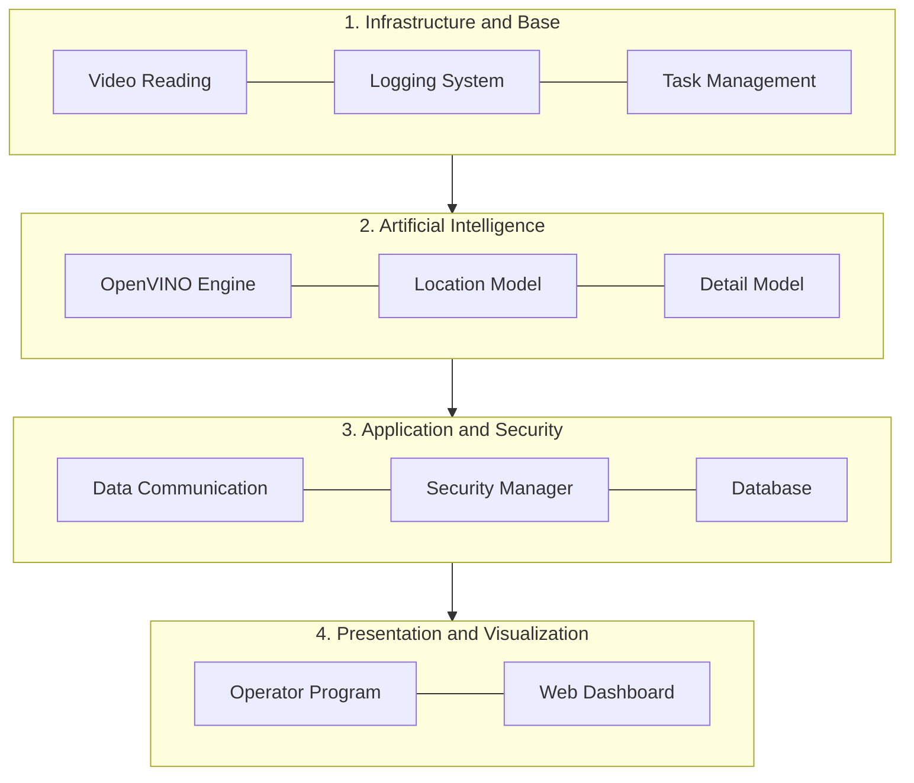
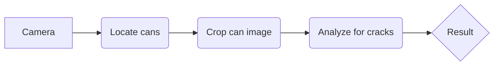
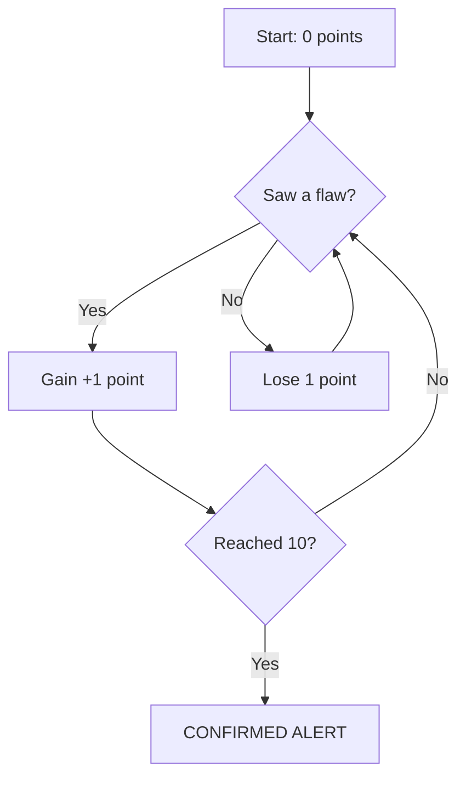

# System Architecture

This document explains how the system works internally and how it is organized to ensure that no defect goes unnoticed.

---

## 1. System Organization (The 4 Layers)

Think of the system as a 4-story building, where each floor has a specific function:

---

## 2. Two-Stage Processing

To ensure the system is both fast and accurate, it uses a funnel strategy:

1.  **Step 1:** The system locates all cans on the conveyor belt and assigns a number to each one.
2.  **Step 2 (VisionFracture):** It crops the image of each can and performs a deep analysis looking for cracks.

!!! tip "Heatmap Analysis"
    The system uses heatmaps to highlight exactly where the flaw was found, making visual verification easier for the operator.

---

## 3. Voting System (Preventing Errors)

This is one of the most important parts of the system. To prevent a simple light reflection from causing a false alarm, the system uses a "voting" process:

The system doesn't decide if there is a crack by looking only once. It looks at the same can multiple times as it passes by the camera.

*   **Positive Vote:** If the system sees a flaw, the can gets +1 point.
*   **Negative Vote:** If the system sees nothing, the can loses 1 point.
*   **Alarm:** The alert is only triggered if the can accumulates **10 points**.

This logic ensures the system is extremely reliable, ignoring temporary flashes on the metal surface.

---

## 4. Performance Evolution

The system is constantly learning. See how the accuracy has improved:

| Version | Project Stage | Detection Accuracy |
|---|---|---|
| V1.0 | Start of Project | 62% |
| V1.2 | Camera Adjustments | 75% |
| V1.5 | Advanced Training | 78% |
| V2.0 | Speed Optimization | 85% |
| V2.1 | Current Version | 93% |

---

Last updated: May 2026
