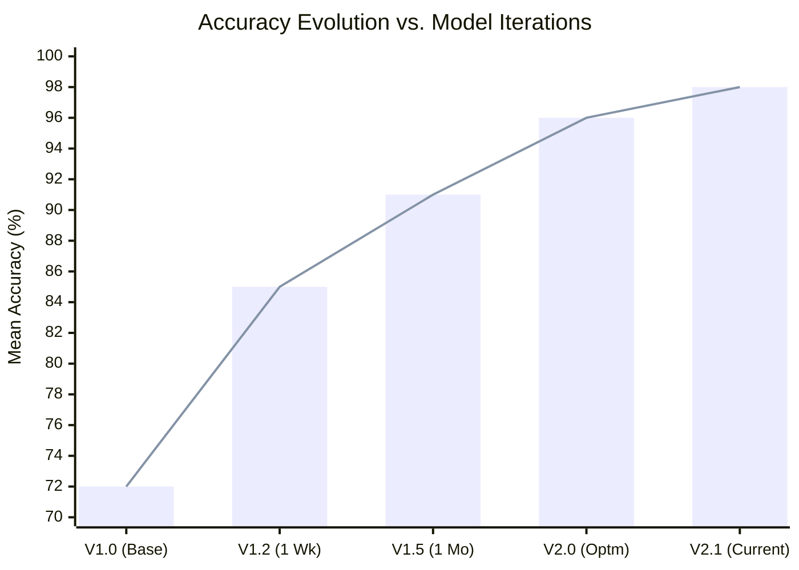

# AI System Architecture

VisionAlign's intelligence is built on a multi-stage architecture designed for stability and precision in industrial environments.

## OpenVINO Integration
The processing core utilizes **OpenVINO IR (Intermediate Representation)** to optimize YOLO models for Intel processors and accelerators.
- **INT8 Quantization:** Optimization that reduces memory footprint and increases processing speed with minimal impact on accuracy.
- **Asynchronous Inference:** Efficient frame management allowing high-throughput inspection without UI latency.

## Uncertainty Detection
The system employs uncertainty estimation logic to identify new defect patterns:
- **Ambiguity Range:** Identifies detections with confidence levels between 30% and 60%.
- **Automatic Capture:** Ambiguous images are isolated for subsequent human validation.
- **Active Learning:** Human feedback on these images fuels the next training cycle, expanding the AI's knowledge base.

## Performance Evolution
The system demonstrates logarithmic accuracy gains as site-specific data volume increases, stabilizing at levels of high operational reliability.

