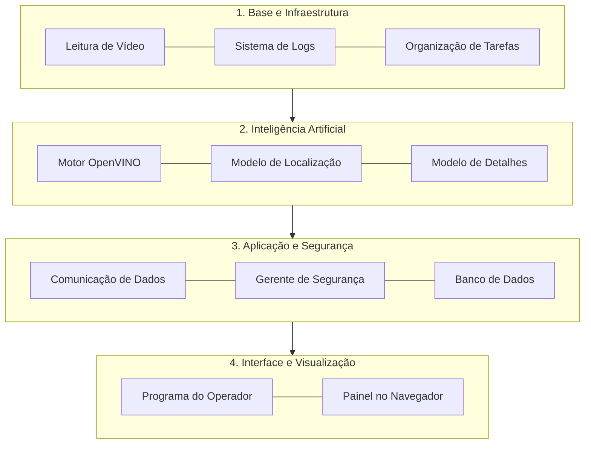
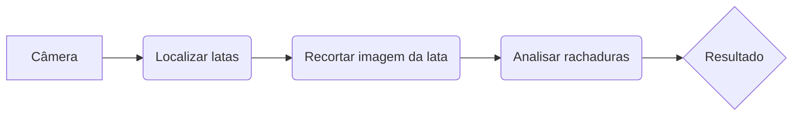
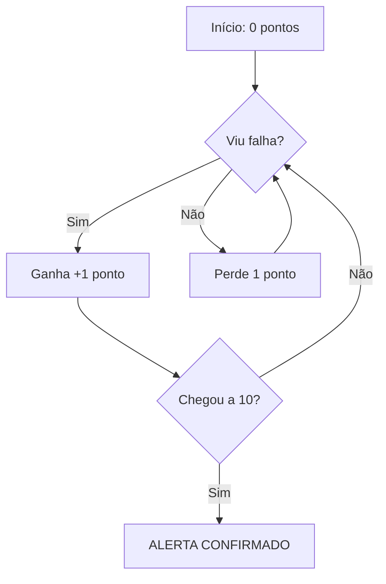

# Arquitetura do Sistema

Este documento explica como o sistema funciona por dentro e como ele é organizado para garantir que nenhuma falha passe despercebida.

---

## 1. Organização do Sistema (As 4 Camadas)

Imagine o sistema como um prédio de 4 andares, onde cada andar tem uma função específica:

---

## 2. Processamento em Duas Etapas

Para garantir que o sistema seja rápido e preciso, ele usa uma estratégia de funil:

1.  **Primeiro Passo:** O sistema localiza todas as latas na esteira e dá um número para cada uma.
2.  **Segundo Passo (VisionFracture):** Depois de localizar a lata, o sistema "recorta" apenas a área dela. Esse recorte é enviado para um segundo modelo de inteligência artificial que procura por rachaduras (fraturas) com muito mais detalhe.

!!! tip "Análise de Calor"
    O sistema utiliza mapas de calor para destacar exatamente onde a falha foi encontrada, facilitando a verificação visual pelo operador.

---

## 3. Sistema de Votação (Evitando Erros)

Este é um dos pontos mais importantes do sistema. Para evitar que um simples reflexo de luz cause um alarme falso, o sistema usa uma "votação":

O sistema não decide se há uma rachadura olhando apenas uma vez. Ele olha para a mesma lata várias vezes enquanto ela passa pela câmera.

*   **Voto Positivo:** Se o sistema vê uma falha, a lata ganha +1 ponto.
*   **Voto Negativo:** Se o sistema não vê nada, a lata perde 1 ponto.
*   **Alarme:** O alerta só é disparado se a lata acumular **10 pontos**.

Esta lógica garante que o sistema seja extremamente confiável, ignorando brilhos passageiros no metal.

---

## 4. Evolução de Desempenho

O sistema está em constante aprendizado. Veja como a precisão melhorou:

| Versão | Etapa do Projeto | Precisão das Detecções |
|---|---|---|
| V1.0 | Início do Projeto | 62% |
| V1.2 | Ajustes na Câmera | 75% |
| V1.5 | Treinamento Avançado | 78% |
| V2.0 | Otimização de Velocidade | 85% |
| V2.1 | Versão Atual | 93% |

---

Última atualização: Maio de 2026
