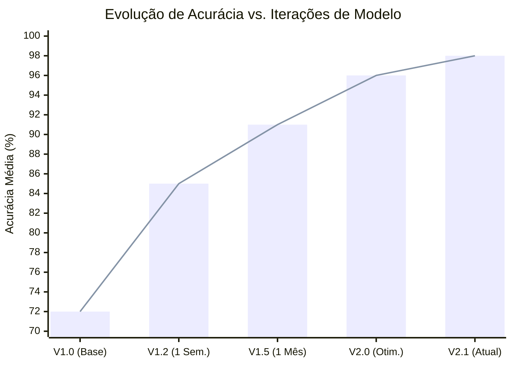

# Arquitetura do Sistema de IA

A inteligência do VisionAlign baseia-se em uma arquitetura de múltiplos estágios para garantir estabilidade e precisão em ambientes fabris.

## Integração OpenVINO
O núcleo do processamento utiliza o **OpenVINO IR (Intermediate Representation)** para otimizar modelos YOLO para processadores e aceleradores Intel.
- **Quantização INT8:** Otimização que reduz o uso de memória e aumenta a velocidade de processamento com impacto mínimo na precisão.
- **Inferência Assíncrona:** Gerenciamento eficiente de frames que permite alta cadência de inspeção sem latência na interface de usuário.

## Detecção de Incertezas
O sistema utiliza uma lógica de estimativa de incerteza para identificar novos padrões de erro:
- **Faixa de Ambiguidade:** Identifica detecções com confiança entre 30% e 60%.
- **Coleta Automática:** Imagens ambíguas são isoladas para posterior validação humana.
- **Aprendizado Ativo:** O feedback humano sobre essas imagens alimenta o próximo ciclo de treinamento, expandindo a base de conhecimento da IA.

## Evolução de Desempenho
O sistema apresenta um ganho de precisão logarítmico conforme o volume de dados específicos da planta aumenta, estabilizando-se em níveis de alta confiabilidade operacional.

