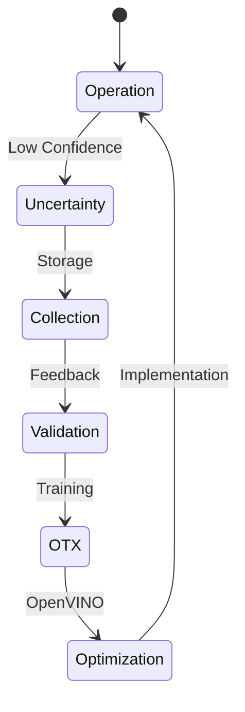

# Continuous Process Improvement

VisionAlign is designed to continuously increase its operational effectiveness. Unlike traditional rule-based vision systems, this solution evolves as new data is processed.

## Enhancement Cycle

## Comparative Analysis

| Criterion | Traditional Computer Vision | VisionAlign AI |
| :--- | :--- | :--- |
| **New Patterns** | Requires software re-engineering | Learning via new examples |
| **Environmental Variability** | Sensitive to light/noise changes | High generalization capability |
| **Maintenance Cost** | High (frequent manual adjustments) | Reduced (self-adjusting) |
| **Scalability** | Complex (hardware-dependent) | High (platform-independent) |

> [!IMPORTANT]
> VisionAlign's strategic advantage lies in its ability to flag the unknown, allowing new failures to be structured into the system's knowledge base.
