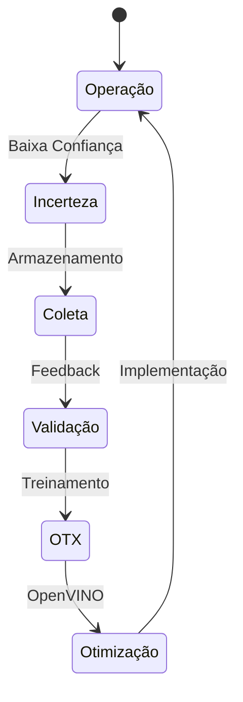

# Melhoria Contínua de Processo

O VisionAlign é projetado para aumentar sua eficácia operacional de forma contínua. Diferente de sistemas de visão tradicionais baseados em algoritmos estáticos, esta solução evolui conforme novos dados são processados.

## Ciclo de Aperfeiçoamento

## Análise Comparativa

| Critério | Visão Computacional Tradicional | VisionAlign AI |
| :--- | :--- | :--- |
| **Novos Padrões** | Requer re-engenharia de software | Aprendizado via novos exemplos |
| **Variabilidade Ambiental** | Sensível a mudanças de luz/ruído | Alta capacidade de generalização |
| **Custo de Manutenção** | Elevado (ajustes manuais frequentes) | Reduzido (auto-ajustável) |
| **Escalabilidade** | Complexa (depende de hardware específico) | Alta (independente de plataforma) |

> [!IMPORTANT]
> O diferencial estratégico do VisionAlign reside na sua capacidade de sinalizar o desconhecido, permitindo que falhas inéditas sejam incorporadas ao conhecimento do sistema de forma estruturada.
