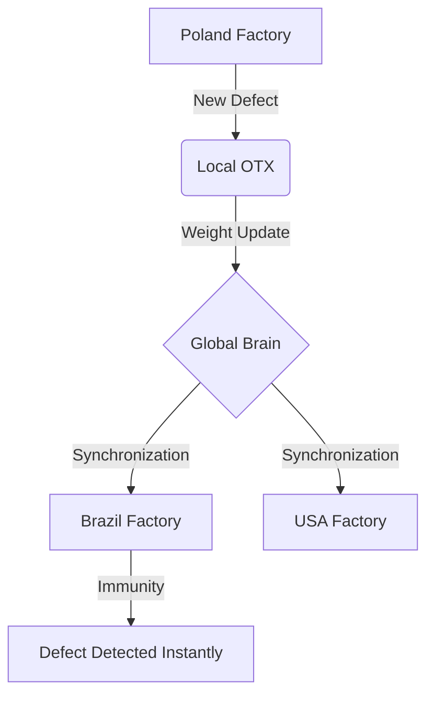

# Global Brain: Industrial Collective Intelligence

The **Global Brain** is the most advanced feature of VisionSystem. It allows the learning from a single machine anywhere in the world to be shared instantly with all other units in your company.

## How it works (The "Learn Once, Know Everywhere" concept)

Imagine your factory in Poland encounters a brand-new defect caused by a rare variation in raw materials.
1.  **Local Discovery:** The AI in Poland detects the anomaly, captures the image, and the OTX system performs automatic retraining.
2.  **Intelligence Sync:** As soon as the new "knowledge" (model weights) is validated, it is sent to the Global Brain (Private Cloud).
3.  **Universal Update:** Without anyone having to press a button, the factory in Brazil receives this update. Now, if that same defect appears in Brazil, the AI will already know exactly what to do, even without ever having seen that error locally before.

---

## Explainable AI: The Heatmap

To ensure that operators and managers fully trust the machine's decision, VisionSystem utilizes **Explainable AI**.

### "Where is the AI looking?"
Instead of just displaying a text box saying "Fracture," the system generates a **Thermal Heatmap** over the image.
*   **Red Glow:** Indicates zones of high neural activation—exactly where the AI found the deformation.
*   **Transparency:** Allows you to see the original metal under the glow, visually confirming the failure.

> **Benefit for the CEO:** You don't need to understand algorithms to know the AI is right. The glow on the screen shows the system's visual "reasoning," eliminating the fear of the "black box."
