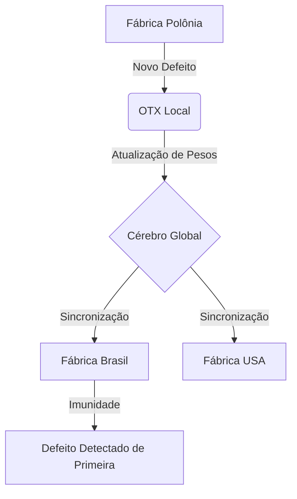

# Cérebro Global: Inteligência Coletiva Industrial

O **Cérebro Global** é o recurso mais avançado do VisionSystem. Ele permite que o aprendizado de uma única máquina em qualquer lugar do mundo seja compartilhado instantaneamente com todas as outras unidades da sua empresa.

## Como funciona (O conceito "Aprendeu Uma, Aprenderam Todas")

Imagine que sua fábrica na Polônia encontre um defeito inédito, causado por uma variação rara na matéria-prima. 
1.  **Descoberta Local:** A IA na Polônia detecta a anomalia, captura a imagem e o sistema OTX realiza o retreino automático.
2.  **Sincronização de Inteligência:** Assim que o novo "conhecimento" (os pesos do modelo) é validado, ele é enviado para o Cérebro Global (Nuvem Privada).
3.  **Atualização Universal:** Sem que ninguém precise apertar um botão, a fábrica no Brasil recebe essa atualização. Agora, se esse mesmo defeito aparecer no Brasil, a IA já saberá exatamente o que fazer, mesmo sem nunca ter visto aquele erro antes localmente.

---

## IA Explicável: O Mapa de Calor (Heatmap)

Para garantir que operadores e gestores confiem plenamente na decisão da máquina, o VisionSystem utiliza a **IA Explicável**.

### "Onde a IA está olhando?"
Em vez de apenas exibir uma caixa de texto dizendo "Fratura", o sistema gera um **Mapa de Calor Térmico (Heatmap)** sobre a imagem. 
*   **Brilho Vermelho:** Indica as zonas de alta ativação neural, ou seja, exatamente onde a IA encontrou a deformação.
*   **Transparência:** Permite ver o metal original sob o brilho, confirmando visualmente a falha.

> **Benefício para o CEO:** Você não precisa entender de algoritmos para saber que a IA está certa. O brilho na tela mostra o "raciocínio" visual do sistema, eliminando o medo da "caixa-preta".
